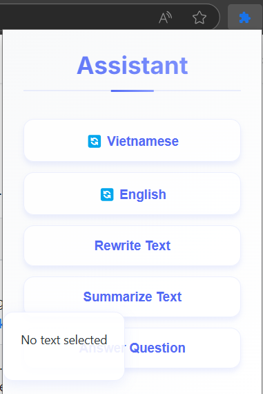

# DeepSeek Assistant Browser Extension

A browser extension that provides easy access to DeepSeek's AI capabilities through their API.



## Features

- Integration with DeepSeek API
- Browser action popup interface
- Context menu integration
- Support for active tab interactions

## Installation

1. Clone this repository
2. Open Chrome/Firefox and navigate to extensions
3. Enable Developer Mode
4. Click "Load unpacked extension"
5. Select the project directory


## Configuration

1. Create a `.env` file in the root directory
2. Add your DeepSeek API key: ```DEEPSEEK_API_KEY=your_api_key_here```


## Usage

1. Click the extension icon in your browser toolbar to open the popup interface
2. Use the context menu by right-clicking on selected text
3. Interact with the active tab through extension features

## Development

- The extension is built using vanilla JavaScript
- Uses the Manifest V2 specification
- Styling is handled through [styles.css](styles.css)
- Background operations are managed in [background.js](background.js)

## Technical Details

- Uses DeepSeek API for AI capabilities
- Implements browser extension best practices
- Supports modern browser features

## License

This project is licensed under the MIT License - see the LICENSE file for details.

## Credits

Built with DeepSeek's API platform: https://platform.deepseek.com/

## Contributing

1. Fork the repository
2. Create your feature branch
3. Commit your changes
4. Push to the branch
5. Open a Pull Request